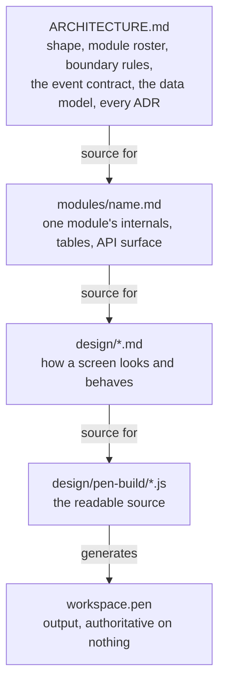

`workspace-ops` is specified across five kinds of document. They are not peers. Each one is
authoritative on something and defers on everything else, and the direction never reverses.

<Tip>
  The short version: **when two documents disagree, the lower rank is the defect.** Fix it there.
  Escalating to `ARCHITECTURE.md` is allowed — but say so out loud, because that file is easy to
  edit and hard to un-edit.
</Tip>

## The chain

## Who decides what

| Rank | Document | Authoritative on | Defers to |
| --- | --- | --- | --- |
| 1 | `ARCHITECTURE.md` | The shape, the module roster, the boundary rules, the event contract, the cross-schema data model, every `ADR-NN` | — |
| 2 | `modules/<name>.md` | That module's internals, its own tables, its API surface | Rank 1 on anything cross-schema |
| 3 | `design/*.md` | How a screen looks and behaves | Ranks 1 and 2 |
| 4 | `design/pen-build/*.js` | What `workspace.pen` is generated from | Rank 3 |
| 5 | `workspace.pen` | **Nothing.** It is output | Rank 4 |

<Warning>
  A cross-schema property has no owner and no reviewer. That is why rank 2 defers to rank 1 on it
  rather than deciding locally — four such properties were already broken by the time the rule was
  written down.
</Warning>

## The folders

<CardGroup cols={2}>
  <Card title="modules/" icon="cube">
    One document per module, eight in all. Indexed by `modules/index.md`.
  </Card>
  <Card title="design/" icon="palette">
    The interface: design system, patterns, components, app shell, and one screen document per
    owning module under `design/screens/`.
  </Card>
  <Card title="use-case/" icon="list-check">
    Reads downward, reports upward. A use case never overrides the architecture — it ends with what
    it could **not** settle, and those gaps become findings.
  </Card>
  <Card title="publishers/" icon="tower-broadcast">
    Deployment-specific by design, and the only place that names real services, tables and call
    sites. Binds one deployment to the contract; never changes it.
  </Card>
</CardGroup>

## Every document is filed

A new document is not finished until it can be reached from `ARCHITECTURE.md`. There are two ways,
and only two.

<Steps>
  <Step title="Add a row to the document index">
    The table near the top of `ARCHITECTURE.md`. Use this for a new *family*, or a document that
    stands on its own.
  </Step>
  <Step title="Or link it from a family index">
    Every folder of documents has exactly one index — `index.md` for a new one, `README.md` where
    one already plays that role. **One folder, one index; never both.** Use this for a new member of
    an existing family, so the root index stays short.
  </Step>
</Steps>

### Two checks, two different questions

<AccordionGroup>
  <Accordion title="Can it be arrived at?" icon="route">
    Walks the markdown link graph outward from `ARCHITECTURE.md` and fails on any document it cannot
    reach, transitively. Reachability is transitive on purpose: the root names a family index, that
    index names its own files, and the chain keeps the root short without letting a file go unfiled.
  </Accordion>
  <Accordion title="Is it filed?" icon="folder-tree">
    Fails on a folder of documents with no index, on an index that does not link a document sitting
    beside it, and on a folder carrying two indexes.

    This exists because reachability alone was not enough, and the gap was live: **one passing
    mention of a module document in a review file kept all eight module documents "reachable" while
    the folder had no index at all.** Deleting that index changed nothing any check could see.
    Reachable is not filed.
  </Accordion>
</AccordionGroup>

<Note>
  Both checks are mechanical, and deliberately so. A document nobody can arrive at is a document
  nobody maintains, and the first symptom is two files disagreeing with no way to tell which is
  stale.
</Note>

## Three documents sit outside the ranking

They answer a different question, so they do not take a rank.

<CardGroup cols={3}>
  <Card title="REVIEW.md" icon="magnifying-glass">
    A feasibility audit, already **applied**. Read it for *why* a mechanism is shaped the way it is —
    never to contradict what is true now. It carries superseded entries of its own, so it is not
    authoritative even about itself.
  </Card>
  <Card title="use-case/" icon="arrow-turn-up">
    Reports upward. Each one closes with what it could not settle; roughly thirty findings arrived
    that way, three of them structural.
  </Card>
  <Card title="publishers/" icon="plug">
    Deployment-specific. Binds a real service to the contract, and is the one place concrete names
    belong.
  </Card>
</CardGroup>

## What is excluded, and why

| Excluded | Reason |
| --- | --- |
| `temp/` | Scratch. Never a source of patterns, conventions or precedent |
| `.claude/` | Harness configuration, not project documentation |
| Any directory with its own `.git` | A nested repository is a checkout of somebody else's tree — its documents are upstream's |

<Warning>
  Exclusion from the checks and adoption into the project are **two questions with two answers**.
  This documentation site is adopted — it has a row in the root document index — and it is still
  excluded from the graph checks, because its content is `.mdx` while the checker walks `.md`.
  Adoption is recorded in the index; exclusion is about what a script can usefully police.
</Warning>

## Why the direction matters

The most damaging thing anyone can do here is edit `ARCHITECTURE.md` to make a mismatch disappear.
That turns a convenience into an architectural claim without anyone deciding it.

There is one sanctioned exception, and it is not a licence to invent: **a lower-ranked document may
discover that the architecture is missing something.** A screen genuinely needs a value the schema
does not hold. That is a finding — recorded as an open question in the document that found it, and
surfaced. It is never closed by quietly adding the column upstream.

## How this site maps onto that hierarchy

Every page on this site renders a source document, and none of them outranks its source.

| This site | Renders |
| --- | --- |
| **Overview** | The plain-language product requirements, which itself renders the architecture |
| **For Operations** · **For Compliance** | The use-case walkthroughs, plus the behavioural half of the architecture |
| **Engineering** | The architecture, the eight module specifications, and the decision records |
| **Design** | The design documents and the screens generated from them |

<Warning>
  **This site is a rendering. It is never a source.**

  If a page here disagrees with the architecture, **this page is the defect** — fix it here. If the
  architecture itself is wrong, say so out loud rather than editing a page to make the mismatch
  disappear.
</Warning>

<Card title="How to read this site" icon="map" href="/overview/how-to-read-this">
  Which of the six tabs is written for you, and what each one is allowed to contain.
</Card>
