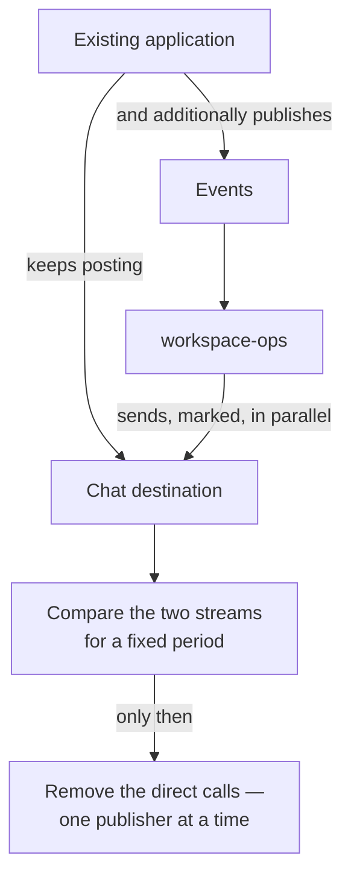

<Note>
  **Each slice ends with something in production, not with a layer that is "ready for the next
  layer".** That is the whole design of the order.
</Note>

<Note>
  **Slice 1 ships in two stages, adopted 2026-07-28.** It was one row until then, and the heading
  still says *five slices* because **the split adds a stage, not a slice** — slices 0, 2, 3 and 4 keep
  their numbers.

  The [delivery roadmap](/overview/roadmap) presents the same plan as six phases for a
  non-engineering reader.
</Note>

| Slice | Modules | Proves | Visible outcome |
| --- | --- | --- | --- |
| **0 · Foundation** | capabilities, registry, architecture gates, `directory`, `audit` | The platform boots from an empty database; **every gate has been proven to fail** | Nothing user-facing. **Do not skip** |
| **1a · Collect** | `automation` — **ingest only** | Both doors, one pipeline; the envelope contract; idempotency and both loop guards; the outbox | *"Which events exist, and what shape are they?"* becomes a screen. **No reactions** |
| **1b · Tell** | `notification`, plus `automation`'s matcher and actions | Workflow matching; recipient resolution; channel policy | **The scattered chat calls are replaced.** First value a person outside the team feels |
| **2 · Work** | `task` | Human work has an owner, an SLA, and a history | Manual procedures leave a trace |
| **3 · Deliberation** | `process` + `integration` | Versioned definitions, the asynchronous return path, vendor abstraction | The onboarding flow runs end to end, human steps included |
| **4 · Output** | `reporting` | Versioned reports, artifacts, submission proof | Regulatory output **with evidence it was filed** |

## Two prerequisites outside this repository

<AccordionGroup>
  <Accordion title="Slice 0 populates directory by the reconciliation sweep, not by events" icon="rotate">
    `automation` does not exist until slice 1, and the person projection **feeds through
    `automation`**.

    So an events-only design ships a foundation **with no people in it**, where every responsibility
    lookup correctly returns empty and nothing works.

    The daily sweep is therefore promoted from *drift correction* to **the population mechanism**, and
    drift correction thereafter.

    It is already specified, it is not event-driven, and it makes the event path a **freshness
    optimisation** rather than the only way data arrives — which is also more robust, since a silent
    upstream stream is a named failure the sweep exists to survive.
  </Accordion>
  <Accordion title="A minimal auth service ships before slice 0" icon="key">
    There is **no local authorization-policy seed**, so slice 0 cannot boot until the estate's auth
    service serves a policy snapshot — and the person sweep above is owned by that service too.

    **Before slice 0, not alongside it.**

    <Warning>
      The failure to guard against is that service shipping **its admin interface** before the endpoint
      that unblocks this one.
    </Warning>
  </Accordion>
</AccordionGroup>

## Why slice 0 cannot be skipped

Its deliverable is not a feature. It is the statement **"every gate has been proven to fail against an
injected defect"**.

<Warning>
  **A gate that has never rejected anything is not a gate; it is a config file.**
</Warning>

That includes:

- One rejected fixture per dependency rule
- **Three** fixtures for the egress rule alone — an npm client, a core-module import, and a bare
  `fetch`. A gate tested only against one client has never been tested
- The company-agnostic grep, with its word-boundary flag exercised

## The migration is a strangler, not a switch

**This is 1b's obligation, not 1a's** — 1a sends nothing, so there is nothing yet to run in parallel
with. 1b must not begin with deleting anything.

<Warning>
  **A missing message during comparison is a matcher defect, not an acceptable difference.**
</Warning>

<Note>
  Running the old and new paths side by side is the **only** way to discover the notifications that
  exist in code but that nobody documented — which is the entire reason this project exists.
</Note>

## What each slice makes visible, by audience

| Slice | Operations | Compliance | Engineering |
| --- | --- | --- | --- |
| **0** | Nothing | Nothing | Boots from empty; every gate proven to fail |
| **1** | Alerts arrive with the data, not a rendered sentence | *"Which events notify whom"* becomes a query | Two doors, one matcher, the outbox pump |
| **2** | My tasks, queues, SLAs, a task history | A skipped step is visible and attributable | Assignment, SLA timers, state changes |
| **3** | Cases with a visible position and reason for waiting | Four-eyes enforced by the engine | Versioned definitions, the async return path, vendor abstraction |
| **4** | Report runs with a status | **Proof of filing**, not a flag | Reproducible runs, artifacts, receipts |

## The one thing that cannot wait for its slice

<Warning>
  **Crypto-shredding must be in place before the first personal data is written — which is now 1a.**

  Retrofitting means re-encrypting an append-only history. It is the one item in the entire design that
  cannot be retrofitted, and splitting the slice moves the first write **earlier**, which makes it more
  urgent rather than less.
</Warning>

## Extraction, when a slice grows out of the process

A module becomes a service when it needs a different scaling profile, a different release cadence, or
a different team.

<Steps>
  <Step title="Dump the schema">
    One command, because there is one schema per module.
  </Step>
  <Step title="Move the module directory">
    `client/` is **copied, not moved**.
  </Step>
  <Step title="Swap the local implementation for a remote adapter">
    **The contract does not change.**
  </Step>
  <Step title="The outbox and stream subscriptions move with it">
    They were never shared.
  </Step>
  <Step title="Remove the registry line">
  </Step>
</Steps>

<Warning>
  **If extraction forces a change in a calling module, a boundary rule was already broken.**

  Every contract is written as though it were already remote: asynchronous, explicit errors, no
  assumption of zero latency, idempotent for writes.
</Warning>

`audit` is the one deliberate exception — permanently un-extractable, because its guarantee depends on
writing inside the caller's transaction.

## Per-slice operational gates

Each slice carries a set of operational gates that must be true before it ships. Two worth naming
here:

- **Retention interlocks.** A key table's retention must exceed the retention of the table it guards,
  and the event key table's retention must exceed the stream horizon.
- **The two concentration risks** — the pump's lack of a priority lane, and the thundering herd of SLA
  timers on batch task creation — need decisions **before slice 2 carries real volume**.

<CardGroup cols={2}>
  <Card title="Decision records" icon="gavel" href="/engineering/decisions">
    All 32, with what each rejected.
  </Card>
  <Card title="Open questions" icon="circle-question" href="/engineering/open-questions">
    Recorded rather than assumed.
  </Card>
</CardGroup>
