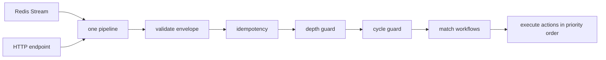

| Door | Who uses it | Auth |
| --- | --- | --- |
| **Redis Stream** — `XADD <domain>:events` | Systems already inside the trusted network; every internal module | **None** — network position is the boundary |
| **HTTP** — `POST /api/v1/automation/events/{eventTypeCode}` | Systems that cannot reach Redis, or that need a synchronous answer | **API key per publisher**, scoped to a set of event-type domains |

<Warning>
  Both doors feed the **identical** matcher and produce the identical ingest row.

  **A behaviour that exists on only one transport is a defect, not a feature.**
</Warning>

## The endpoint exists because a row exists

<Note>
  **The HTTP endpoint exists because an event type is registered, not because code was written.**

  Registering an event type in the interface creates its ingress endpoint immediately. There is no
  deploy, and there is no controller per event type.
</Note>

This is why two failures that look similar are deliberately distinguished:

| Response | Means | Whose problem |
| --- | --- | --- |
| `404` | This event type is **not registered** | The publisher, or a configurator who has not registered it |
| `unmapped` | It **is** registered, and no workflow matches yet | A configurator, as a queue item |

## The stream wire shape

```
XADD <domain>:events MAXLEN ~ <n> * envelope '<the envelope JSON, verbatim>'
```

<Note>
  This is stated because *"both doors feed the identical matcher"* **is not checkable until the stream
  door has a written wire shape** — and without one, the first publisher to build against it invents a
  field name that the ingest parser must then match byte for byte.

  That is a contract gap wearing the costume of an implementation detail.
</Note>

### One field, not flattened pairs

A Redis entry is natively a map, so spreading the envelope across `eventId`, `eventType`,
`occurredAt`… is the obvious move and **the wrong one**.

<Warning>
  It creates a **second wire representation** of the envelope that has to be kept in step with the
  JSON the HTTP door receives.

  Two representations of one contract is exactly the "behaviour on only one transport" defect this
  section forbids, arriving through the back door.

  **The envelope is the contract; the transport carries it whole.**
</Warning>

### Why the field is called `envelope`

Not `payload` — because the envelope *has* a payload, called `data`.

<Note>
  A field name that could mean either is a name that will be read wrong at 3am.
</Note>

## `eventId` is required on both doors

Optional would mean every timeout retry becomes a duplicate notification that nobody notices.

**One idempotency rule for both doors.**

## Authentication per door

<Tabs>
  <Tab title="Redis Stream">
    **None.** Network position is the boundary.

    This is the one door with no API key, and the design states it explicitly on the screen rather
    than leaving it to be assumed.

    Disabling a subscription stops reading; the stream keeps accumulating and is processed on
    re-activation — so a disabled subscription renders as **neutral**, never as an error.
  </Tab>
  <Tab title="HTTP">
    **API key per publisher**, scoped to a set of event-type domains.

    A publisher using a wrong key or an out-of-scope domain gets `401` / `403`, and — importantly —
    the payload is **not stored**.

    <Warning>
      **An unauthenticated body is not evidence.** The rejection is recorded as a metric, never as a
      row.
    </Warning>
  </Tab>
</Tabs>

## Publishers are a global resource


Whoever edits publishers decides **who may inject events**, so it is a separately-granted global
resource alongside destinations and vendor credentials.

<Note>
  The default listing is **all publishers, not active-only**. Hiding inactive keys would hide the ones
  most likely to be a problem — a key idle for months with zero events is exactly what you want on
  screen.
</Note>

## Streams


`automation` is the only stream reader. Everything else — including every internal module — is a
publisher.

<Note>
  **An open question is drawn rather than hidden:** the pending-message count is shown on this screen
  and has **no column** in the subscription table. It is a live read, not stored state, and the screen
  says so rather than letting the number be mistaken for persisted data.
</Note>

## What happens after the door

Both doors converge immediately:



Every stage writes to the same ingest row, whatever the outcome — **including the outcomes that
produce nothing**.

<CardGroup cols={2}>
  <Card title="The HTTP door, in the API reference" icon="code" href="/api/conventions">
    One of only **two** paths in the whole API document with provenance above the design layer.
  </Card>
  <Card title="Idempotency and loop guards" icon="fingerprint" href="/engineering/events/idempotency">
    The next stage, and the PostgreSQL rule that forced its design.
  </Card>
  <Card title="Publishing guide" icon="tower-broadcast" href="/engineering/publishing/guide">
    What a source service has to do to use either door.
  </Card>
</CardGroup>
