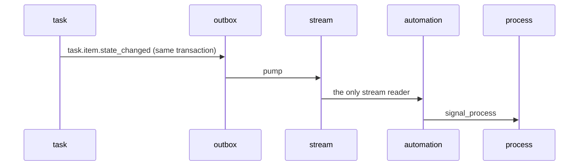

> **The work layer.** One unit of human work: an owner, a state, a deadline, a form, evidence, and a
> complete history of who moved it.

| | |
| --- | --- |
| Schema | `task` |
| Layer | Work |
| Depends on | `directory`, `notification` via `client/`; the artifact-store and clock capabilities |
| Depended on by | `automation` (`create_task`), `process` (human steps) |
| Slice | **2 — Work** |
| Extraction trigger | Task volume, or a distinct team owns the work-management product |

## Why it is its own module

Because **human work is a domain, not a step type.**

It has a queue, a due date, a priority, a comment thread, attachments, a reassignment history, an
SLA, and a bulk-action interface. None of that belongs inside a process engine — and all of it is
needed **even when there is no process at all**.

<Note>
  Ad-hoc work created directly by an `automation` action is a **first-class case**, not a degraded
  one.
</Note>

## The single most important rule

<Warning>
  **`task` must not know that `process` exists.**

  Enforced by a dependency rule, not by convention. It buys two things: **no cycle in the module
  graph**, and **a task module that stays usable on its own**.
</Warning>

When a task reaches a terminal state it publishes `task.item.state_changed` to its outbox. That event
goes to the stream, re-enters through ingest like any external event, and matches a workflow whose
action is `signal_process`.



## Internal structure

```
task/internal/
├── lifecycle/    states, transitions, comments, attachments
├── assignment/   resolution through directory, reassignment, escalation
└── sla/          reminder, breach, expiry timers
```

## Assignment resolves through responsibility rules

A task type carries a **responsibility descriptor** — a domain and a role — which this module passes
to `directory`.

<Note>
  It does **not** pass a task type. Responsibility rules have no task-type column and the query has no
  such field, so a rule written against a task type is deliberately **not representable**.

  Responsibility keys on *what kind of work it is*, never on *what kind of thing it is about*.
</Note>

## What happens when resolution finds nobody

The assignment notice's delivery ends `no_recipient` — **not `succeeded`** — so the event becomes
`partial` and appears in the same work queue as a failed action.

<Warning>
  **One screen, one story.** Before that rule, the ingest history showed green for work nobody was
  told about.
</Warning>

## When an assignee disappears

The `directory` projection deactivates them upstream, and the SLA timer **escalates to the fallback in
the responsibility chain**. No manual reassignment sweep, and no orphaned task.

## The screens it owns

<Tabs>
  <Tab title="My tasks">
    
  </Tab>
  <Tab title="Kanban view">
    

    A **view option, not a new screen** — same data, same permissions.
  </Tab>
  <Tab title="Queues">
    

    Scope is `queue:<domain>` — the third dimension of authorization, beyond resource and action.
  </Tab>
  <Tab title="Task detail">
    

    Note **provided links**: a link that arrived in an envelope is the one URL a reviewer is trained
    to click, so its **provenance is shown** rather than the platform appearing to vouch for it.
  </Tab>
</Tabs>

## Principal tables

Generated from `migrations/task/001-init.sql` — never drawn by hand.

```mermaid
erDiagram
    task_types {
        uuid id PK
        varchar code
        varchar name
        varchar domain
        jsonb form_schema
        text[] outcome_values
        interval default_sla
        interval hard_deadline
        more 8_further_columns
    }
    tasks {
        uuid id PK
        varchar type_code
        varchar subject_type
        varchar subject_ref
        varchar title
        varchar state
        varchar priority
        uuid assignee_person_id
        more 17_further_columns
    }
    task_state_changes {
        uuid id PK
        uuid task_id FK
        varchar from_state
        varchar to_state
        varchar actor_ref
        varchar actor_type
        varchar reason
        uuid comment_id
        more 7_further_columns
    }
    task_comments {
        uuid id PK
        uuid task_id FK
        varchar author_ref
        text body
        boolean internal
        timestamptz created_at
    }
    task_attachments {
        uuid id PK
        uuid task_id FK
        uuid artifact_id
        varchar filename
        varchar content_type
        bigint size_bytes
        varchar uploaded_by
        timestamptz uploaded_at
        more 1_further_columns
    }
    outbox {
        bigint id PK
        uuid aggregate_id
        varchar target
        varchar operation
        jsonb payload
        varchar idempotency_key
        uuid correlation_id
        uuid causation_id
        more 8_further_columns
    }
    tasks ||--o{ task_state_changes : "task_id"
    tasks ||--o{ task_comments : "task_id"
    tasks ||--o{ task_attachments : "task_id"
```

<Warning>
  **No relationship line leaves this schema, and that is the boundary rule rather than an omission.** The 3 lines above are real foreign keys inside `task`.

  Bare cross-schema references — drawn nowhere, because the database does not enforce them: `artifact_id` into `platform.artifacts`, and the subject pair. Neither is a key.
</Warning>

<Note>
  **`task_state_changes` deliberately duplicates part of the audit record.**

  The operational timeline needs joins and SLA arithmetic on **hot** data; the audit record is
  immutable and retained for years. **Different consumers, different retention, different
  guarantees.**
</Note>

Attachments go through the platform artifact-store capability — which is also why there is no
`document` module. A module would have forced `task → reporting`, a dependency whose name lies about
what it is for.

## Authorization scope

Every task carries a `text[]` of scope labels, **derived once at creation** from its subject and its
type.

| Label | Example |
| --- | --- |
| Queue | `queue:compliance` |
| Counterparty | `partner:4711` |
| Entity | `entity:sg` |

<Warning>
  **Derived once, never re-derived.** Re-deriving at read time would let a responsibility-rule change
  silently alter who can see historical work.

  **An empty array means unscoped and visible**, not hidden. The opposite reading looks exactly like a
  permissions bug.
</Warning>

## A recorded concentration risk

<Warning>
  **Batch task creation fires a thundering herd of SLA timers** at the same instant.

  Recorded rather than solved, with a decision due before this slice carries real volume.
</Warning>

<CardGroup cols={2}>
  <Card title="directory" icon="address-book" href="/engineering/modules/directory">
    Where the owner comes from.
  </Card>
  <Card title="notification" icon="bell" href="/engineering/modules/notification">
    Where the assignment notice goes — and where a failed resolution surfaces.
  </Card>
</CardGroup>
