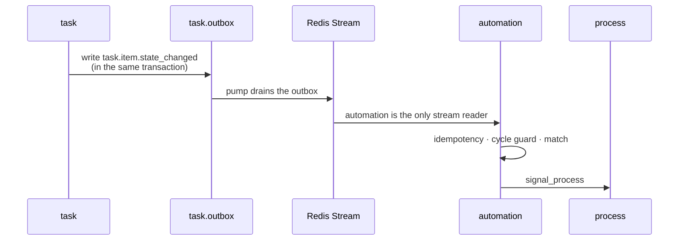

This is the central structural decision, and the one most easily got wrong.

<Warning>
  Reactions, processes, and work items have **different lifetimes, different state requirements, and
  different failure modes**. Putting them in one component produces a stream consumer with a state
  machine inside it — and a system that cannot answer *"where is this case stuck?"*
</Warning>

## The three

| Layer | Module | State | Lifetime of one unit | Failure means |
| --- | --- | --- | --- | --- |
| **Reflex** | `automation` | Stateless. Each event is independent | seconds | The action retries or dies. Nothing is "in progress" |
| **Deliberation** | `process` | Stateful, versioned, resumable | hours to days | The instance waits. It must survive restarts and be visible |
| **Work** | `task` | Stateful, owned by a person | minutes to days | An SLA is breached and someone must be told |

## The test

Apply in order. Stop at the first yes.

<Steps>
  <Step title="Can it complete without waiting for anything or anyone?">
    → **`automation`**
  </Step>
  <Step title="Does it need to remember where it is between two things that may be days apart?">
    → **`process`**
  </Step>
  <Step title="Does a human have to do it?">
    → **`task`**
  </Step>
</Steps>

## The worked example

```
customer.account.created   ─ reflex ─▶   start the "customer onboarding" process
                                         │
                            deliberation │  step 1  automatic  identity.verify      (integration)
                                         │  step 2  automatic  screening.sanctions  (integration)
                                         │  step 3  human      compliance review    (task)
                                         │  step 4  human      operations approval   (task)
                                         │  step 5  automatic  generate + submit report (reporting)
                                         ▼
                            work         each human step is one task with an assignee, an SLA,
                                         a form, attachments, and a full state history
```

<Note>
  **`automation` alone cannot do this** — it would have to remember that step 2 finished while step 3
  waits for a person on leave.

  **`process` alone cannot do it either** — a person needs a queue, a due date, a comment thread, and
  a place to attach a document. That is a domain of its own.
</Note>

## Why each module refuses the others' job

<AccordionGroup>
  <Accordion title="automation holds no state between events" icon="bolt">
    An event is matched, intent is written, and the event is done.

    If `automation` had to remember that step 2 of a case finished while step 3 waits for a person, it
    would be **a state machine living inside a stream consumer** — the exact failure this architecture
    is built to avoid.

    It is also **not** split into `automation` + `workflow`. A workflow *is* automation's core
    concept: the ordered action list bound to a matched event type. Separating the trigger from what
    it triggers pays the full price of a module boundary for nothing.
  </Accordion>
  <Accordion title="process holds position, not people" icon="diagram-project">
    Three properties, none of which belong in a stream consumer:

    - **It has a position.** *"Waiting on compliance review, since Tuesday, breaching in four hours."*
    - **It must survive a restart.** A deploy mid-case cannot lose the case.
    - **It must be auditable against the rules in force when it started**, not the rules in force
      today.

    `task` cannot hold that either, without learning about steps that are not human — at which point
    `task` stops being usable for ad-hoc work.
  </Accordion>
  <Accordion title="task must not know process exists" icon="list-check">
    **The single most important sentence in the task specification**, and it is enforced by a
    dependency rule rather than a convention.

    It buys two things: no cycle in the module graph, and a task module that stays usable on its own.
    Ad-hoc work created directly by an `automation` action is a first-class case, not a degraded one.
  </Accordion>
</AccordionGroup>

## The return path is what makes this work

Since `task` cannot call `process`, something else has to resume the case.



**Cost:** one Redis round trip per resumption.

**Bought:**

- **Durability** — the resumption survives a restart on either side.
- **Visibility** — internal transitions appear in the same ingest history as external events, so the
  operational timeline is one queryable list.
- **A `task` module usable without any process at all.**

<Note>
  This is also why `automation` is the **only** stream reader. Internal modules are publishers exactly
  like external systems, which is what makes "two doors, one pipeline" true for internal traffic as
  well — and puts ordering, idempotency and both loop guards in **one** place instead of four.
</Note>

## What each layer is not allowed to grow into

| Layer | Must never become |
| --- | --- |
| `automation` | A state machine. If it needs to remember, it is a process |
| `process` | A BPMN engine. Sequence, branch, parallel, wait, timer — nothing more |
| `task` | Aware of processes. The moment it is, the cycle returns and ad-hoc work degrades |

<CardGroup cols={2}>
  <Card title="Module roster" icon="cubes" href="/engineering/module-roster">
    All eight, with schemas and tables.
  </Card>
  <Card title="Matching and actions" icon="filter" href="/engineering/events/matching-and-actions">
    What the reflex layer actually does with a matched event.
  </Card>
</CardGroup>
