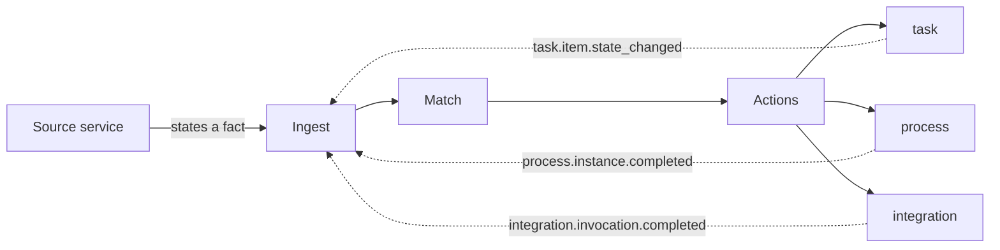

Everything the platform does is one loop, run over and over. This page walks it once, end to end.


## The eight steps

<Steps>
  <Step title="Publish" icon="tower-broadcast">
    A source service states a **fact**, in the past tense. `treasury.deposit.received`, not
    `treasury.deposit.notify_compliance`. An `eventId` is required — it identifies the *occurrence*,
    not the thing.
  </Step>
  <Step title="Ingress" icon="door-open">
    The event enters through one of **two doors** — a Redis Stream, or an HTTP endpoint — into one
    identical pipeline. A behaviour that exists on only one transport is a defect, not a feature.
  </Step>
  <Step title="Idempotency" icon="fingerprint">
    The `eventId` is checked. A duplicate is dropped, so **a fact becomes work exactly once** —
    however many times it was delivered.
  </Step>
  <Step title="Cycle guard" icon="rotate-left">
    Keyed on the event type **and its subject**. A reaction cannot loop into itself forever, and a
    healthy case that legitimately repeats an event type is not mistaken for a loop.
  </Step>
  <Step title="Match" icon="filter">
    The matcher finds the workflow or workflows for this event. **Every match runs**, in priority
    order. No match means `unmapped` — visible, and a work queue of its own.
  </Step>
  <Step title="Actions" icon="bolt">
    Each matched workflow runs its actions in order — one of eight kinds: `notify` · `create_task` ·
    `start_process` · `signal_process` · `call` · `project` · `record` · `emit`.
  </Step>
  <Step title="Work or process" icon="user-check">
    The action mints a **task** — an owner resolved from responsibility rules, an SLA, a form — or
    advances a **process** instance waiting on a signal.
  </Step>
  <Step title="Return" icon="arrows-rotate">
    When the work completes, it re-enters as a **new event** through the same ingress. The loop is
    uniform: internal transitions are indistinguishable from external facts.
  </Step>
</Steps>

## Drawn as a graph


The same pipeline, redrawn as connected nodes. The walkthrough above reads as prose steps; this reads
as a workflow graph. Same content, different lens.

## What an event actually looks like

```json
{
  "eventId":       "0192f4c1-1f1a-7b3e-8e0f-6a1c9f0b2d33",
  "eventType":     "customer.account.created",
  "specVersion":   "1.0",
  "occurredAt":    "2026-07-21T04:10:00.000Z",
  "source":        "core-api",
  "subject":       { "type": "customer", "ref": "CUS-10293" },
  "actor":         { "type": "user", "ref": "u-441" },
  "correlationId": "0192f4c1-1f1a-7b3e-8e0f-6a1c9f0b2d34",
  "causationId":   null,
  "depth":         0,
  "data":          { "tier": "individual", "country": "ID", "channel": "mobile" }
}
```

<Note>
  **The publisher states what happened. It never states what should be done about it.**

  These seven fields are **rejected** if they appear in an envelope: `severity` · `recipients` ·
  `channel` · `template` · `actions` · `assignee` · `priority`.

  Each of them is a *decision*, not a *fact*. Allowing them would put routing policy back into the
  publishing service's codebase — which is the condition this platform exists to end.
</Note>

## The return loop is why this stays simple

When a task finishes, `task` does not call `process` to tell it. It publishes
`task.item.state_changed`, which goes to the stream, re-enters through the same ingest as any
external event, and matches a workflow whose action is `signal_process`.



This costs one round trip per resumption. Two things are bought with it:

- **Durability** — the resumption survives a restart on either side.
- **Visibility** — internal transitions appear in the same history as external events, so the entire
  operational timeline is **one queryable list**.

<Tip>
  This is also why `task` is usable on its own. It never learns that `process` exists, so it works
  perfectly well for ad-hoc work that belongs to no process at all.
</Tip>

## Where the journey can end early — and be seen

Every dead end is a visible state, not a silent drop.

| Ending | Means | Who sees it |
| --- | --- | --- |
| `invalid` | The envelope broke the contract — a bad subject type, a number where a decimal was declared | Configurator, on the events screen |
| `duplicate` | This `eventId` already arrived. HTTP answers `409` | Nobody needs to; it is counted |
| `depth_exceeded` · `cycle_detected` | A **configuration defect** — two workflows baiting each other | Configurator, surfaced separately from delivery failures |
| `unmapped` | Registered, but nobody has configured a reaction yet | A work queue with "build a workflow from this event" attached |
| `observed` | Somebody decided this is worth keeping and worth nothing else | Nobody — deliberately |
| `suppressed` | An exclusive workflow deliberately silenced it | Visible on the event, so the silence is explainable |
| `partial` | Something ran and something did not — including *a notification that reached nobody* | Operator, in the same queue as a failed action |
| `dead` | An action exhausted its retries | Operator |
| `dispatched` | Everything that was configured to run, ran | — |

<Warning>
  **`no_recipient` makes the event `partial`, never green.** An alert that resolved to nobody is not
  a success with a footnote. Before this rule, the ingest history showed green for an alert nobody
  received, and the finding lived only in the delivery log where nobody looked.
</Warning>

## Two doors, one pipeline

| Door | Who uses it | Authentication |
| --- | --- | --- |
| **Redis Stream** — `XADD <domain>:events` | Systems already inside the trusted network, and every internal module | None — network position is the boundary |
| **HTTP** — `POST /api/v1/automation/events/{eventTypeCode}` | Systems that cannot reach Redis, or that need a synchronous answer | **API key per publisher**, scoped to a set of event-type domains |

Both feed the **identical** matcher and produce the identical history row.

<Note>
  **The HTTP endpoint exists because an event type is registered, not because code was written.**
  Registering an event type in the interface creates its ingress endpoint immediately.

  This is why `404` (this event type is not registered) is deliberately different from `unmapped` (it
  is registered, but no workflow matches yet).
</Note>

<CardGroup cols={2}>
  <Card title="Who uses it" icon="users" href="/overview/who-uses-it">
    Five personas, and which screens each one lives in.
  </Card>
  <Card title="The full event contract" icon="file-contract" href="/engineering/events/contract">
    The engineering version — every rule, and the failure each one prevents.
  </Card>
</CardGroup>
