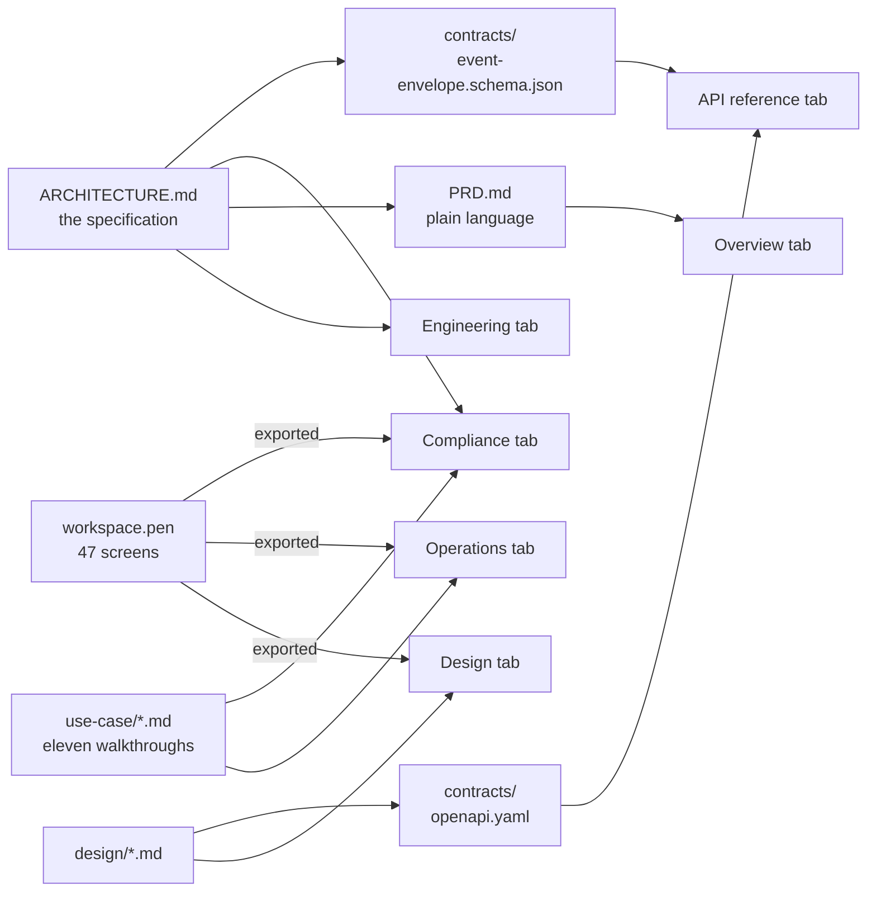

`workspace-ops` has to be explained to three groups of people who need different things from the
same system. A compliance officer needs to know what evidence survives an audit. An operations
analyst needs to know what lands on their screen at 9am. A senior engineer needs the event contract,
the schema boundaries, and the reason each of them is shaped that way.

Writing one document for all three produces a document none of them finish. So this site is split
into **six tabs**, and each tab has exactly one reader in mind.

<Note>
  **Every tab describes the same system.** The tabs differ in vocabulary and depth, not in facts.
  Where a non-technical page simplifies something, it links to the engineering page that states it
  precisely — never to a different answer.
</Note>

## The six tabs

<CardGroup cols={2}>
  <Card title="Overview" icon="compass" href="/">
    **Everyone, first.** What the platform is, the problem it was built from, how one event travels
    end to end, who uses it, and the delivery roadmap. Read this before your own tab.
  </Card>
  <Card title="For Operations" icon="list-check" href="/operations">
    **Ops analysts and their leads.** No architecture. What your day looks like, which screen answers
    which question, what an SLA breach looks like before it happens, and four worked scenarios.
  </Card>
  <Card title="For Compliance" icon="scale-balanced" href="/compliance">
    **Compliance, MLRO, legal, internal audit.** What evidence the platform produces, how a decision
    is reconstructed months later, maker-checker, retention and erasure, and an honest list of what
    it does *not* prove.
  </Card>
  <Card title="Engineering" icon="cube" href="/engineering">
    **Senior engineers and reviewers.** The dividing principle, eight modules and their hard
    boundaries, the event contract in full, the data model, authorization, deployment, and every
    architecture decision record.
  </Card>
  <Card title="API reference" icon="file-contract" href="/api">
    **Implementers and publishing-service owners.** The event envelope schema, the HTTP surface, and
    an honest account of which parts of it are specified and which are harvested from screens.
  </Card>
  <Card title="Design" icon="palette" href="/design">
    **Anyone evaluating the interface.** The design language, the navigation model, the six recurring
    screen patterns, and a gallery of every designed screen exported from `workspace.pen`.
  </Card>
</CardGroup>

## Which tab is yours

| If you are… | Read | Then, if you want more |
| --- | --- | --- |
| A **senior / supervising engineer** reviewing the design | Overview → **Engineering** | Design, for what the screens commit the backend to |
| A **compliance officer or MLRO** | Overview → **For Compliance** | Design → Screen gallery, to see the evidence surfaces |
| An **operations analyst or team lead** | Overview → **For Operations** | For Compliance, for the audit side of your own work |
| A **product or delivery lead** | Overview, all of it | Engineering → Delivery slices, Open questions |
| A **service owner** whose service will publish events | Overview → Engineering → **Integrating a service** | **API reference → The event envelope** — the schema you validate against |
| An **implementer** picking up the build | Engineering, all of it | **API reference → What is deliberately absent** — it doubles as a gap list |

## What each tab is allowed to contain

This is the rule that keeps the tabs from drifting into three inconsistent products.

<Steps>
  <Step title="Overview states facts once">
    The problem, the core idea, the roadmap. Both audience tabs and the engineering tab may restate
    an Overview fact — none of them may contradict it.
  </Step>
  <Step title="Operations and Compliance describe behaviour, never mechanism">
    They say *what happens and what you see*. They do not carry table names, JSON, route paths, or
    module boundaries. Where a mechanism matters to the reader, they link to Engineering and stop.
  </Step>
  <Step title="Engineering carries the mechanism, and the reasons">
    Contracts, schemas, ADRs, trade-offs, and the things that were tried and rejected. It is the
    only tab where a claim may be qualified with an open question.
  </Step>
  <Step title="Design carries the interface, and only the interface">
    Screens are evidence that the architecture is usable. No screen introduces a concept that does
    not already exist in a module — where the design adds something, it is labelled a design
    decision, not smuggled in.
  </Step>
  <Step title="The API reference states its own provenance, per operation">
    It is a **harvest, not a design**: every path was collected from a document that already exists,
    and nothing was invented to fill a gap. Where a source names an operation but never describes its
    body, the operation says `UNSPECIFIED` rather than carrying a plausible schema.
  </Step>
</Steps>

## Where this content comes from

Nothing on this site is newly invented. Every page renders a document from the `workspace-ops`
design spike, and the source hierarchy is described in [Document structure](/document-structure).

<Note>
  **The two arrows into the API reference are not the same weight, and the tab says so.** The envelope
  schema derives from the architecture. The OpenAPI document is harvested almost entirely from screen
  documents — **only two of its 84 paths are named in a source that ranks above the design layer.**
</Note>

<Warning>
  **This documents a design spike, not a running system.** There is no product code yet. Every
  screenshot on this site is a design export from `workspace.pen`, not a screenshot of software.
  Where a page describes behaviour, it describes *specified* behaviour. Pages that depend on an
  unresolved decision say so rather than guessing.
</Warning>

## Conventions used throughout

| Convention | Meaning |
| --- | --- |
| `code style` | A real identifier — an event type, a status value, a table, a route. It is exact |
| **§N** and **ADR-NN** | A section or decision record in the architecture specification. Any claim can be checked against it |
| A page marked *Honest limits* | States what the platform does **not** do. These are load-bearing, not disclaimers |
| An **Open question** callout | Genuinely undecided. Not a gap in the writing — a gap in the design, deliberately visible |

<Tip>
  Short on time? Read [The problem](/overview/problem) and [An event's
  journey](/overview/event-journey). Between them they carry about eighty percent of what anyone
  needs to argue with the design.
</Tip>
