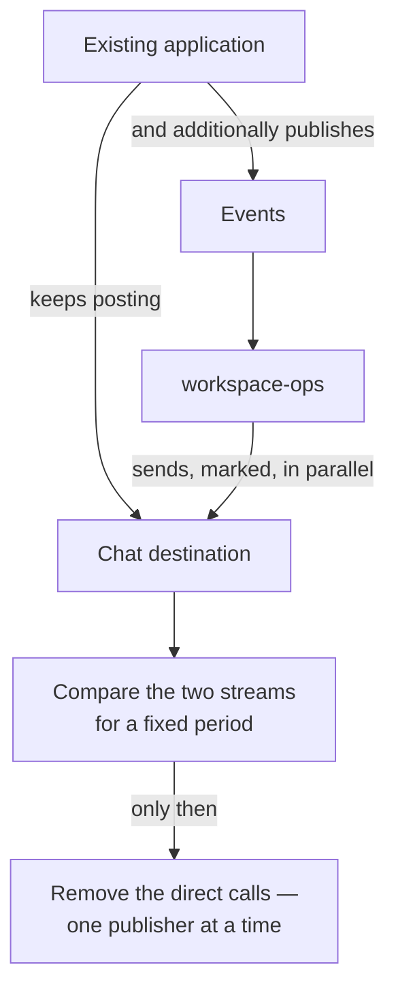

<Note>
  **Adopted into `ARCHITECTURE.md` §16 on 2026-07-28.** This page and the specification now agree.

  The change was one split: §16's Slice 1 became two ordered stages, **1a · Collect** and **1b ·
  Tell**. **Nothing was renumbered** — slices 0, 2, 3 and 4 keep their numbers, because `slice N` is
  referenced around eighty times across the corpus, including in a document that is *applied* and
  carries superseded entries. Renumbering would have rewritten a historical record to relabel work
  that did not change.
</Note>

## The six phases

<Steps>
  <Step title="Phase 0 · Collect" icon="inbox">
    **Ships:** the foundation, plus event ingest — **collect events and store them**. No reactions.

    **Proves:** the envelope contract survives real traffic. Both doors, idempotency, the depth and
    cycle guards, the outbox, and the platform capabilities.

    **Visible outcome:** *"which events actually exist, and what shape are they?"* becomes a screen —
    a question nobody in the estate can answer today without grepping seven codebases.
  </Step>

  <Step title="Phase 1 · Tell" icon="bell">
    **Ships:** `notification` — workflows, recipient resolution, channel policy.

    **Proves:** the last mile, and the responsibility model that no service in the estate has.

    **Visible outcome:** **the scattered chat calls are replaced.** This is the phase that pays for
    the project.
  </Step>

  <Step title="Phase 2 · Work" icon="list-check">
    **Ships:** `task`.

    **Proves:** human work has an owner, a deadline, a form and a history.

    **Visible outcome:** a skipped step leaves a trace. **Six independent copies of one maker-checker
    rule** collapse into one configured control.
  </Step>

  <Step title="Phase 3 · Deliberate" icon="diagram-project">
    **Ships:** `process` + `integration`.

    **Proves:** versioned definitions, the asynchronous return path, vendor abstraction behind logical
    capabilities.

    **Visible outcome:** the onboarding flow runs end to end, human steps included.
  </Step>

  <Step title="Phase 4 · Prove" icon="file-invoice">
    **Ships:** `reporting`.

    **Proves:** reproducible runs, artifacts, and submission receipts.

    **Visible outcome:** *"we filed it"* stops being a claim and becomes a record.
  </Step>

  <Step title="Phase 5 · Risk intelligence" icon="chart-line">
    **Endorsed as the next phase, and not specified.**

    <Warning>
      Its scope, score store, schema and retention are **not defined anywhere**. It must be reconciled
      with the separate risk-intelligence write-up **before** it is planned, not during.
    </Warning>
  </Step>
</Steps>

## How this maps onto §16

So nobody has to hold two numbering schemes in their head.

| This phasing | `ARCHITECTURE.md` §16 |
| --- | --- |
| **Phase 0 · Collect** | Slice 0 (Foundation) **+ Slice 1a · Collect** |
| **Phase 1 · Tell** | **Slice 1b · Tell** |
| **Phase 2 · Work** | Slice 2 |
| **Phase 3 · Deliberate** | Slice 3 |
| **Phase 4 · Prove** | Slice 4 |
| **Phase 5 · Risk intelligence** | Beyond §16 |

## Why splitting ingest from notification is right

§16 bundles them because *"the scattered chat calls are replaced"* is the first visible value, and a
slice ending with nothing user-facing is hard to defend. That objection is real and the split has to
answer it.

<Note>
  **It answers it with the platform's own rule.** The workflows screen's primary action is *"browse
  unmapped events"*, **not** *"create workflow"* — because **a workflow is only ever built from a
  shape that already arrived.** One written against an imagined envelope matches nothing, and the
  failure is silent.

  That makes Phase 0 a **prerequisite for doing Phase 1 correctly**, not a detour before it.
</Note>

Three further arguments:

<CardGroup cols={3}>
  <Card title="A mistake damages nothing" icon="shield">
    Phase 0 has no outbound door. A wrong condition spams nobody, calls no vendor, and files no
    report. Every subsequent phase adds a way to be wrong *at somebody*.
  </Card>
  <Card title="The hardest contract is proved first" icon="file-contract">
    Idempotency, the cycle guard, decimal handling and the two-door equivalence are the things most
    expensive to get wrong late — and they are all exercised by ingest alone.
  </Card>
  <Card title="It produces a real answer" icon="magnifying-glass">
    **47 events are publishable as written**, 68 need publisher discipline, and 18 cannot be published
    at all. Phase 0 turns that from an estimate into a measurement.
  </Card>
</CardGroup>

<Warning>
  **The cost of the split, stated:** Phase 0 ends with a database of envelopes and a read-only screen.
  If the organisation cannot fund a phase whose outcome is *"we can now answer a question"*, bundle it
  back into one phase and accept the higher risk in Phase 1.
</Warning>

## What "Phase 0" must contain that the words do not say

This is the part most likely to be under-scoped, and the reason is that *"collect events and store
them"* sounds smaller than it is.

<AccordionGroup>
  <Accordion title="The foundation does not disappear" icon="cube">
    Ingest needs the platform capabilities, the module registry, the architecture gates, `directory`,
    and `audit` — all of §16's Slice 0.

    **`audit` in particular is not deferrable.** Every configuration change from day one — registering
    an event type, adding a publisher, minting an API key — must be recorded, or the record has a hole
    exactly where the system was most volatile.
  </Accordion>

  <Accordion title="Crypto-shredding lands in Phase 0, not later" icon="key">
    <Warning>
      **This is the single most important sentence on this page.**

      Personal data must be encrypted with a per-subject key **before the first personal data is
      written**. Phase 0 writes envelopes. **Envelopes contain personal data.**

      Retrofitting means re-encrypting an append-only history. It is **the one item in the entire
      design that cannot be retrofitted**, and the split moves the first write **earlier** — which
      makes it more urgent rather than less. §16 now binds it to stage 1a explicitly.
    </Warning>
  </Accordion>

  <Accordion title="Phase 0 cannot boot without the auth service" icon="lock">
    There is no local authorization-policy seed. The platform **refuses to start** without a policy
    snapshot — deliberately, because a process that starts with no policy denies every request.

    The person projection is owned by that service too.

    **A minimal `auth-service` ships before Phase 0**, not alongside it. The failure to guard against
    is that service shipping its admin interface before the endpoint that unblocks this one.
  </Accordion>

  <Accordion title="Registration is the work, not the code" icon="table-list">
    An ingress endpoint exists **because an event type is registered**, not because code was written.

    So Phase 0's real content is: event types, subject types with their reference formats, publishers
    with scoped API keys, and stream subscriptions. **139 event types are already seeded**; the ones
    this deployment needs must be chosen and their subject formats verified against real references.
  </Accordion>

  <Accordion title="Storing is not keeping" icon="clock">
    <Warning>
      The ingest history is **dropped on a months-long schedule**. That is correct for an operational
      history and **silently wrong for any obligation measured in years** — the partition drops on
      time, the fact is gone, and **nothing failed**.
    </Warning>

    If Phase 0 is expected to satisfy a retention obligation, it needs **record types** with their own
    retention, not just ingest. Decide which obligations apply *in* Phase 0, because the horizon
    starts running the moment the first event lands.
  </Accordion>
</AccordionGroup>

## A parallel workstream, owned by other teams

This does not fit in the phase sequence, and starting it late is the most likely cause of a slipped
Phase 1.

<Warning>
  **18 events cannot be published at all** because the fact is never durable in the source service —
  nothing is written, or it lives in a local variable, or a `catch` swallows it. Across the wider
  estate, **32 such occurrences are itemised**, each with the change its service needs.

  **These are prerequisites, not enhancements**, and they are owned by teams that are not building
  this platform.
</Warning>

Two of them are worth escalating on their own merits, independently of this roadmap:

| Finding | Why it does not wait for a phase |
| --- | --- |
| **A four-eyes control that approves itself** | One auto-approval path records creator and approver as the same automated actor. Gated by a feature flag, and **silent** — nothing is emitted when it fires |
| **A funding destination can vanish with no durable record** | Account deletion writes nothing and the identifier ceases to exist |

## Gates — what must be true before each phase ships

| Phase | Gate |
| --- | --- |
| **0** | Every architecture gate **proven to fail** against an injected defect. Crypto-shredding in place. `auth-service` serving a policy snapshot. Ingest retention decided — it is also the backfill horizon for every report declared later |
| **1** | The strangler comparison run for a fixed period, with **a missing message treated as a matcher defect, not an acceptable difference** |
| **2** | Two concentration risks decided: the outbox pump has **no priority lane**, and batch task creation fires a **thundering herd of SLA timers** |
| **3** | **The field-level redaction policy for identity-verification responses agreed with compliance — before this phase ships, not after** |
| **4** | The **business-day calendar** and the **absolute-deadline anchor** resolved. A filing deadline counted in calendar days when the statute says business days is wrong in exactly the direction that matters |
| **5** | Scope reconciled with the risk-intelligence write-up before planning |

## The migration is a strangler, not a switch

Phase 1 must not begin by deleting anything.

<Note>
  Running both paths side by side is the **only** way to discover the notifications that exist in code
  but that nobody documented — which is the entire reason this project exists.
</Note>

## What each phase makes visible, by audience

| Phase | Operations | Compliance | Engineering |
| --- | --- | --- | --- |
| **0** | Nothing to do yet | The first inventory of what actually happens | Boots from empty; every gate proven to fail; the contract survives real traffic |
| **1** | Alerts arrive with the data, not a rendered sentence | *"Which events notify whom"* becomes a query | Recipient resolution, channel policy, the outbox pump |
| **2** | My tasks, queues, SLAs, a history | A skipped step is visible and attributable | Assignment, SLA timers, state changes |
| **3** | Cases with a visible position and reason for waiting | Four-eyes enforced by the engine | Versioned definitions, the async return path, vendor abstraction |
| **4** | Report runs with a status | **Proof of filing**, not a flag | Reproducible runs, artifacts, receipts |

<CardGroup cols={2}>
  <Card title="Open questions" icon="circle-question" href="/engineering/open-questions">
    Every gate above traces to one of these.
  </Card>
  <Card title="The estate" icon="sitemap" href="/engineering/publishing/estate">
    Which services can publish, and the readiness tiers behind the 47 / 68 / 18 split.
  </Card>
</CardGroup>
