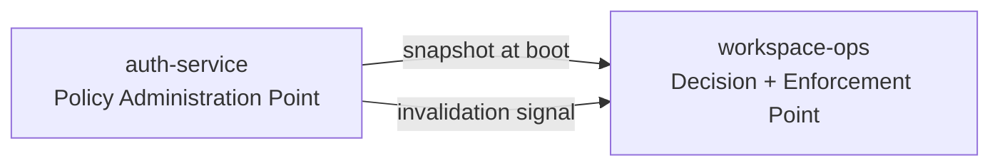

Every request into `workspace-ops` passes **two sequential guards**. They answer different questions,
and passing the first tells you nothing about the second.

```
1. module access        module:<name>:access             can this subject enter the module at all?
2. resource permission  <resource>:<action>:<scope>      may they do this specific thing?
```

<Warning>
  **This page is a rendering of `ARCHITECTURE.md` §11. It is never the source.** If the two disagree,
  this page is the defect. The permission *catalogue* — which roles exist and who holds them — is not
  owned here at all; see [Where policy comes from](#where-policy-comes-from).
</Warning>

## The first guard is derived, not declared

The module name comes from the **route prefix**, not from an annotation.

<Note>
  *"A decorator can be omitted; a route prefix cannot."* — `ARCHITECTURE.md` §11
</Note>

This is a deliberate rejection of the annotate-every-controller pattern. An annotation-based module
guard fails **open** when someone forgets it: the endpoint ships, the check never runs, and nothing
in review looks wrong because the missing thing is invisible. Deriving the module from routing makes
the guard a property of *where the endpoint lives*, which cannot be forgotten because it cannot be
left out.

The second guard — the resource permission — is per-operation and must be stated.

## The three dimensions

<CardGroup cols={3}>
  <Card title="Resource" icon="box">
    What is being acted on — `task`, `workflow`, `destination`, `publisher`, `entry`.
  </Card>
  <Card title="Action" icon="bolt">
    What is being done — `read`, `write`, `activate`, `revoke`, `retry`, `export`.
  </Card>
  <Card title="Scope" icon="filter">
    **Where it applies.** The dimension that matters operationally, and the one usually missing from
    a homegrown model.
  </Card>
</CardGroup>

Scope is why a compliance reviewer can hold `task:read` inside `queue:compliance` and hold nothing at
all inside `queue:treasury`. Scopes are declared **per resource type**, and:

<Warning>
  **The wildcard `*` is a distinct, separately grantable permission — never the default.** A model
  where "no scope specified" means "all scopes" grants production-wide access by omission.
</Warning>

## Three resources are global, and granted separately

Holding any of these is equivalent to holding production credentials, so none of them is reachable
through an ordinary module grant.

| Resource | Why it is separate |
| --- | --- |
| `integration:destination` | Whoever edits these decides **where data goes** |
| `integration:provider_credential` | …and **with what secret** |
| `automation:publisher` | Whoever edits these decides **who may inject events** |

Their screens carry a distinct visual treatment for the same reason — a key mark, a warning rule, and
a confirmation on **every** mutation including edits, not only deletes.

## A list endpoint does not resolve through the enforcer

This is the part most RBAC designs get wrong, and it is worth reading twice.

<Steps>
  <Step title="A single-resource route reads the scope from the row">
    You have the row, so you have its scope. Ask the enforcer about that one label.
  </Step>
  <Step title="A list route has no row yet">
    There is nothing to ask about. So the enforcer instead yields the **set** of scope labels the
    subject holds, and the repository filters on it.

    ```sql
    -- unless the subject holds the wildcard for this (resource, action)
    WHERE (scopes = '{}' OR scopes && :granted_scopes)
    ```
  </Step>
</Steps>

<Warning>
  **The `scopes = '{}'` arm is mandatory.** An empty array means *unscoped and visible*. Omit that
  clause and every unscoped row disappears for everyone — while looking exactly like a permissions
  bug, which is the hardest kind of defect to attribute.
</Warning>

## Where policy comes from

The enforcer is local. **The policy it enforces is not authored here.**



| Owned by `auth-service` | Owned by `workspace-ops` |
| --- | --- |
| Resource and action vocabulary | Both guards, evaluated in-process |
| Which role holds which permission | **Scope evaluation** — labels derived from `tasks.scopes` and its siblings, which no external service can read |
| Which person holds which role | The route-prefix module guard |
| Grant audit, access review, expiry | — |

The enforcer, the snapshot loader and the watcher come from the estate's **shared client package** —
they are not written here. A hand-rolled copy would be one more implementation of a security control
the estate has already shown it cannot keep consistent across services.

### Two consequences, both accepted deliberately

<AccordionGroup>
  <Accordion title="Revocation is eventually consistent" icon="clock-rotate-left">
    Bounded by a < 5 s p99 invalidation. For the three global resources above, that window is the
    residual risk — and the control for it is a **short-lived token**, not a faster policy channel.
  </Accordion>
  <Accordion title="It starts without auth-service, but not without a policy" icon="power-off">
    If `auth-service` becomes unreachable **after** boot, the platform keeps serving its last known
    snapshot and alerts.

    If the snapshot is unavailable **at** boot, it **refuses to start** — because a process that
    starts with no policy denies every request, which is an outage wearing the costume of a bug.
  </Accordion>
</AccordionGroup>

<Card title="Applying it to an endpoint" icon="code" href="/reference/applying">
  The practical half — what to declare, what is derived for you, and the four mistakes this model is
  shaped to prevent.
</Card>
